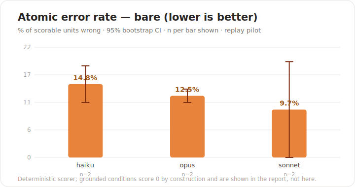
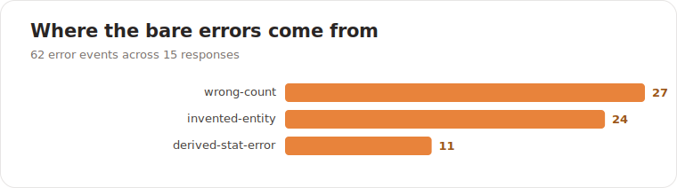

# Dungeons & Skills — a grounded D&D 2024 skill pack

*[Français](README.fr.md)*

[](https://github.com/mlabarrere/dungeons-and-skills/actions/workflows/test.yml)

-black)


> [!WARNING]
> **Rules data — personal use only.** The catalog (`data/`, `docs/`) is derived from D&D 2024
> material (Wizards of the Coast). The *code* is MIT; the *rules data* is for personal use —
> do not redistribute commercially. See [ATTRIBUTION.md](ATTRIBUTION.md).

A multi-skill, multi-platform, tested project that helps any AI assistant (Claude, ChatGPT,
Cursor, Copilot and friends) **build and check Dungeons & Dragons 2024 ("5.5") characters** — and
get the rules right.

## Quickstart (pick your host)

| Host | Install | Then |
|------|---------|------|
| **Claude Code** | `node install.mjs` (or `npx github:mlabarrere/dungeons-and-skills`) — plugin marketplace coming soon | `/dnd-build` |
| **Any project (script)** | `npx github:mlabarrere/dungeons-and-skills` (or clone + `node install.mjs`) | open Claude Code there, `/dnd-build` |
| **Claude / ChatGPT Projects** | paste [`project-mode/INSTRUCTIONS.md`](project-mode/INSTRUCTIONS.md), upload [`project-mode/knowledge/`](project-mode/knowledge/) | ask it to build a character |
| **Cursor / Windsurf / Cline / Kiro / Copilot** | the rule auto-loads from a checkout, or copy the matching adapter (see [PLATFORMS.md](PLATFORMS.md)) | describe the task |
| **Any other agent** | point it at [`AGENTS.md`](AGENTS.md) | — |

Full details: [INSTALL.md](INSTALL.md).

## Why it exists

A language model's training data blends the D&D editions (3.5, 5e 2014, 5.5/2024, Pathfinder)
into rules that sound right and are wrong. A character sheet is arithmetic with citations, so a
single wrong value makes it illegal. One rule therefore overrides everything else: **do not trust
the model's memory — read the bundled rules catalogue and run a deterministic engine.** See
[rules/grounding.md](rules/grounding.md).

## Skills

| Skill | What it does |
|-------|--------------|
| [`dnd-build`](skills/dnd-build/SKILL.md)  | Guided level-1 character creation, with zero rules errors. |
| [`dnd-check`](skills/dnd-check/SKILL.md)  | Audit an existing sheet and flag every rules error (the sheet checker). |
| [`dnd-lookup`](skills/dnd-lookup/SKILL.md) | Look up a spell, feat or class from the catalogue and cite the source. |
| [`dnd-help`](skills/dnd-help/SKILL.md)   | How the family works, and what grounding means. |

## How it works

- **Catalogue** (`data/*.json`): 12 classes, 48 subclasses, 10 species, 16 backgrounds, 75 feats
  and around 390 spells — the deterministic rules data, generated from the source of truth in
  `docs/`.
- **Engine** (`engine/`): `resolver.mjs` returns only the rules-legal options at each step;
  `build-character.mjs` works out AC, hit points, save DCs and spell counts and then lints the
  result; `cli.mjs` is the command the skills call.
- **Grounding rule** ([rules/grounding.md](rules/grounding.md)): embedded word-for-word in every
  skill, in `AGENTS.md`, in the Project-mode instructions and in every platform adapter — kept in
  step by `scripts/check-rule-copies.mjs`.

```bash
# from the repository root
node engine/cli.mjs options answers.json           # the next legal choices (rules-filtered)
node engine/cli.mjs build   answers.json --lang en  # answers -> sheet + lint (needs 0 errors)
node engine/cli.mjs check   sheet.character.json    # audit an existing sheet
```

Worked examples live in [examples/](examples/) (`dwarf-fighter`, `elf-druid` — answers plus the
expected sheet).

## How good is each skill? (benchmarks)

The measure is objective and needs no human judgement: a **deterministic scorer** rebuilds each
answer from the engine and counts every rules error, by category and severity. The headline
number is the **atomic error rate** — the share of *verifiable units* (class, each ability, AC,
HP, each spell, each factual claim…) that are wrong. Each skill has its own tasks, oracle and
metrics; five conditions can be compared (`bare` → `full-project`); the full method is in
[benchmarks/README.md](benchmarks/README.md).

**Exploratory ablation — real models, `dnd-build`, 5 characters each**
([report](benchmarks/reports/pilot-build-ablation.md)). `bare` = the model builds from memory,
no tools; `skill-engine` = the same model reads the skill and actually runs the engine
(`node engine/cli.mjs`) and interprets the output itself:



| Model | bare (no skill) | skill-engine | relative reduction | perfect sheets |
|---|--:|--:|--:|---|
| Haiku 4.5 | 21.0% | **0.6%** | −97% | 0/5 → 4/5 |
| Sonnet 5 | 14.2% | **0.0%** | −100% | 1/5 → 5/5 |
| Opus 4.8 | 15.3% | **0.6%** | −96% | 0/5 → 5/5 |

From memory even the strongest model gets ~1 in 7 verifiable facts wrong (missed species
hit-point bonus, wrong prepared-spell count, wrong saving throws, changed the briefed scores).
Reading the skill and running the engine drops that to near zero — and, tellingly, `skill-engine`
is **not** a flat 0: Haiku and Opus each slipped once transcribing an engine value, so this is a
measured model result, not the engine's own output injected.



> Honest limits: this ablation is **`dnd-build` only, 5 characters, n=1** — exploratory, not a
> league table. The intermediate conditions (`grounding-only`, `skill-only`, `full-project`), the
> reasoning-level sweep, and the other three skills' ablations are implemented but not yet run at
> scale. The scorer itself is proven by a deterministic oracle run scoring 34/34 tasks at zero
> errors ([self-check](benchmarks/reports/oracle-selfcheck.md)); no unrun figure is fabricated.

```bash
npm run bench:oracle                       # deterministic self-consistency (offline, 0 errors)
npm run bench:replay -- --skills dnd-build --conditions bare,skill-engine   # re-score the captures
node benchmarks/runner.mjs --backend live --conditions bare,grounding-only,skill-only,skill-engine \
  --models haiku,sonnet,opus --reasoning off,high --reps 5 --dry-run        # widen it (needs a key)
```

## Documentation

- [INSTALL.md](INSTALL.md) — how to install it on each platform (Claude Code, Projects, Cursor, Windsurf and so on).
- [PLATFORMS.md](PLATFORMS.md) — agent portability and the adapter model.
- [rules/grounding.md](rules/grounding.md) — the grounding rule; [rules/schema.md](rules/schema.md) — the schema and the formulas.
- [CONTRIBUTING.md](CONTRIBUTING.md) · [CODE_OF_CONDUCT.md](CODE_OF_CONDUCT.md) · [SECURITY.md](SECURITY.md) · [CHANGELOG.md](CHANGELOG.md)

## Languages

Output is in French or English. The internal ids are French (the engine's keys); the English
display names come from `data/labels.en.json` (the structural entities are complete; spell names
are being added over time).

## Using it

- **Claude Code** — the skills load automatically from `skills/`, or install the plugin from
  `.claude-plugin/`. Slash commands: `/dnd-build`, `/dnd-check`, `/dnd-lookup`, `/dnd-help`.
- **Cursor / Windsurf / Cline / Kiro / GitHub Copilot** — the always-on rule is generated into
  each tool's native format (`.cursor/rules/`, `.windsurf/rules/`, `.clinerules/`,
  `.kiro/steering/`, `.github/copilot-instructions.md`).
- **Claude / ChatGPT Projects** — paste [project-mode/INSTRUCTIONS.md](project-mode/INSTRUCTIONS.md)
  into the Project's custom instructions and upload `project-mode/knowledge/` as its knowledge.
- **Any other agent** — point it at [AGENTS.md](AGENTS.md).

## Developing

```bash
node scripts/build-bundles.mjs    # regenerate engine/ + data/ + project-mode/knowledge from docs/
node scripts/build-adapters.mjs   # regenerate the platform adapters from AGENTS.md
npm run skill:check               # check-sync + check-rule-copies (nothing has drifted)
npm test                          # node --test: correctness, behaviour, catalogue, adapters, packaging, scorer
```

The single source of truth is `docs/` (the rules base) and the `dnd-builder` section of
`AGENTS.md` (the rule text). `engine/`, `data/` and the adapters are generated, so do not edit
them by hand.

## Scope and limits

Level 1 only (levelling up from 2 to 20 is reported as "Manquant documentaire"). Chosen origin
feats are recorded, but their mechanical effects are not expanded yet (granted feats are) — see
[dnd-help](skills/dnd-help/SKILL.md).

## Licence and attribution

The original work (engine, scripts, skill prose, documentation) is under the
[MIT Licence](LICENSE). The rules data under `data/` and `docs/` is derived from D&D 2024 material
and is included for **private use**; before distributing it publicly, keep the content within the
**SRD 5.2 (2024, CC-BY-4.0)** and attribute it — see [ATTRIBUTION.md](ATTRIBUTION.md). This is
unofficial fan content and is not affiliated with Wizards of the Coast.

> This work includes material from the System Reference Document 5.2 ("SRD 5.2") by Wizards of
> the Coast LLC, available at https://www.dndbeyond.com/srd. The SRD 5.2 is licensed under the
> Creative Commons Attribution 4.0 International License.
