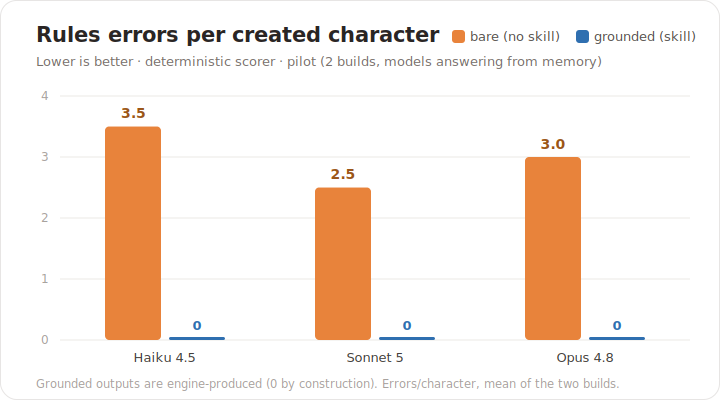
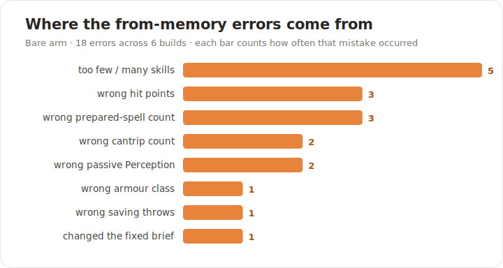

# D&D 2024 Character Builder — a grounded skill pack

*[Français](README.fr.md)*

 -black) 

A multi-skill, multi-platform, tested project that helps any AI assistant (Claude, ChatGPT,
Cursor, Copilot and friends) **build and check Dungeons & Dragons 2024 ("5.5") characters** — and
get the rules right.

**New here? → [INSTALL.md](INSTALL.md) to set it up, then run `/dnd-build`.**

## Why it exists

A language model's training data blends the D&D editions (3.5, 5e 2014, 5.5/2024, Pathfinder)
into rules that sound right and are wrong. A character sheet is arithmetic with citations, so a
single wrong value makes it illegal. One rule therefore overrides everything else: **do not trust
the model's memory — read the bundled rules catalogue and run a deterministic engine.** See
[rules/grounding.md](rules/grounding.md).

## Skills

| Skill | What it does |
|-------|--------------|
| [`dnd-build`](skills/dnd-build/SKILL.md)  | Guided level-1 character creation, with zero rules errors. |
| [`dnd-check`](skills/dnd-check/SKILL.md)  | Audit an existing sheet and flag every rules error (the sheet checker). |
| [`dnd-lookup`](skills/dnd-lookup/SKILL.md) | Look up a spell, feat or class from the catalogue and cite the source. |
| [`dnd-help`](skills/dnd-help/SKILL.md)   | How the family works, and what grounding means. |

## How it works

- **Catalogue** (`data/*.json`): 12 classes, 48 subclasses, 10 species, 16 backgrounds, 75 feats
  and around 390 spells — the deterministic rules data, generated from the source of truth in
  `docs/`.
- **Engine** (`engine/`): `resolver.mjs` returns only the rules-legal options at each step;
  `build-character.mjs` works out AC, hit points, save DCs and spell counts and then lints the
  result; `cli.mjs` is the command the skills call.
- **Grounding rule** ([rules/grounding.md](rules/grounding.md)): embedded word-for-word in every
  skill, in `AGENTS.md`, in the Project-mode instructions and in every platform adapter — kept in
  step by `scripts/check-rule-copies.mjs`.

```bash
# from the repository root
node engine/cli.mjs options answers.json           # the next legal choices (rules-filtered)
node engine/cli.mjs build   answers.json --lang en  # answers -> sheet + lint (needs 0 errors)
node engine/cli.mjs check   sheet.character.json    # audit an existing sheet
```

Worked examples live in [examples/](examples/) (`dwarf-fighter`, `elf-druid` — answers plus the
expected sheet).

## Does grounding actually help?

The measure is objective and needs no human judgement: a **deterministic scorer** rebuilds each
character with the engine and counts every rules error, by type. Two arms are compared — **bare**
(the model builds from memory) and **grounded** (the model is made to use the catalogue and
engine).

In the pilot the three Claude models each built the two briefs from memory, with no tools; the
grounded figures are what the engine produces. Even the strongest model averages a few rules
errors per character from memory. Grounded, all three score zero.



| Model | Bare (no skill) | Grounded (skill) |
|---|--:|--:|
| Haiku 4.5 | 3.5 errors/character | **0.0** |
| Sonnet 5 | 2.5 errors/character | **0.0** |
| Opus 4.8 | 3.0 errors/character | **0.0** |

The mistakes are real ones: a missed species hit-point bonus, the wrong number of prepared
spells, the wrong pair of saving throws, or quietly changing the ability scores the brief had
fixed.



Full method and how to reproduce (more repeats, live API, reasoning levels):
[benchmarks/README.md](benchmarks/README.md) · [pilot report](benchmarks/results/2026-07-11-pilot.md).

```bash
npm run bench -- --replay --models haiku,sonnet,opus --arms bare,grounded
npm run bench:report -- --out results/mine.md
```

> The pilot is small (2 builds, one run each): it is directional, not a league table. Widen it
> with `--reps`, `--live` and more tasks.

## Documentation

- [INSTALL.md](INSTALL.md) — how to install it on each platform (Claude Code, Projects, Cursor, Windsurf and so on).
- [PLATFORMS.md](PLATFORMS.md) — agent portability and the adapter model.
- [rules/grounding.md](rules/grounding.md) — the grounding rule; [rules/schema.md](rules/schema.md) — the schema and the formulas.
- [CONTRIBUTING.md](CONTRIBUTING.md) · [CODE_OF_CONDUCT.md](CODE_OF_CONDUCT.md) · [SECURITY.md](SECURITY.md) · [CHANGELOG.md](CHANGELOG.md)

## Languages

Output is in French or English. The internal ids are French (the engine's keys); the English
display names come from `data/labels.en.json` (the structural entities are complete; spell names
are being added over time).

## Using it

- **Claude Code** — the skills load automatically from `skills/`, or install the plugin from
  `.claude-plugin/`. Slash commands: `/dnd-build`, `/dnd-check`, `/dnd-lookup`, `/dnd-help`.
- **Cursor / Windsurf / Cline / Kiro / GitHub Copilot** — the always-on rule is generated into
  each tool's native format (`.cursor/rules/`, `.windsurf/rules/`, `.clinerules/`,
  `.kiro/steering/`, `.github/copilot-instructions.md`).
- **Claude / ChatGPT Projects** — paste [project-mode/INSTRUCTIONS.md](project-mode/INSTRUCTIONS.md)
  into the Project's custom instructions and upload `project-mode/knowledge/` as its knowledge.
- **Any other agent** — point it at [AGENTS.md](AGENTS.md).

## Developing

```bash
node scripts/build-bundles.mjs    # regenerate engine/ + data/ + project-mode/knowledge from docs/
node scripts/build-adapters.mjs   # regenerate the platform adapters from AGENTS.md
npm run skill:check               # check-sync + check-rule-copies (nothing has drifted)
npm test                          # node --test: correctness, behaviour, catalogue, adapters, packaging, scorer
```

The single source of truth is `docs/` (the rules base) and the `dnd-builder` section of
`AGENTS.md` (the rule text). `engine/`, `data/` and the adapters are generated, so do not edit
them by hand.

## Scope and limits

Level 1 only (levelling up from 2 to 20 is reported as "Manquant documentaire"). Chosen origin
feats are recorded, but their mechanical effects are not expanded yet (granted feats are) — see
[dnd-help](skills/dnd-help/SKILL.md).

## Licence and attribution

The original work (engine, scripts, skill prose, documentation) is under the
[MIT Licence](LICENSE). The rules data under `data/` and `docs/` is derived from D&D 2024 material
and is included for **private use**; before distributing it publicly, keep the content within the
**SRD 5.2 (2024, CC-BY-4.0)** and attribute it — see [ATTRIBUTION.md](ATTRIBUTION.md). This is
unofficial fan content and is not affiliated with Wizards of the Coast.
